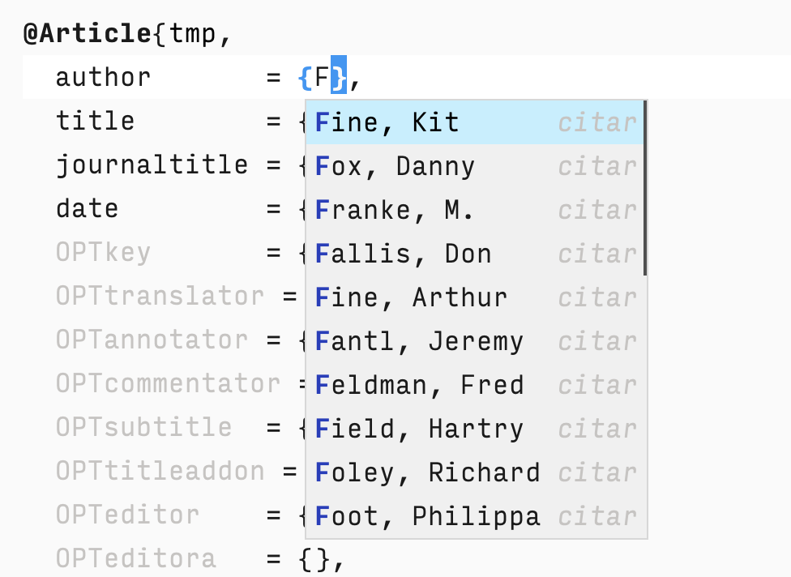

* Bib-capf: completion-at-point for BibTeX files
:PROPERTIES:
:ID:       20250427T215401.464447
:END:

If you manage your .bib files using Emacs, it can be convenient to have a completion-at-point function when writing the values for certain fields. Here's a small library that defined such a function. It can optionally make use of the citar hash table, thus avoiding having to parse each file in your bibtex-files.

#+DOWNLOADED: screenshot @ 2025-04-27 21:54:01
#+attr_html: :width 40% :align center
#+attr_latex: :width 0.5\textwidth

By setting =bib-capf-source= to ='citar=, the capf will make use of the data generated by =citar-cache--entries=. The default value for =bib-capf-source= is ='local=, which means only the current buffer will be used for completions. Alternatively, =bib-capf-source= can be set to ='bibtex-files=, in which case =bib-capf= will make use of all files in =bibtex-files=, a variable defined in =bibtex.el=.

* Installation

Using =straight.el=, the following should suffice:

#+begin_src elisp
(use-package bib-capf
  :after (citar bibtex)
  :straight (bib-capf :type git :host github :repo "apc/bib-capf")
  :hook (bibtex-mode . bib-capf-setup)
  :custom
  ;; Alternative values: 'local or 'bibtex-files
  (bib-capf-source 'citar))
#+end_src

